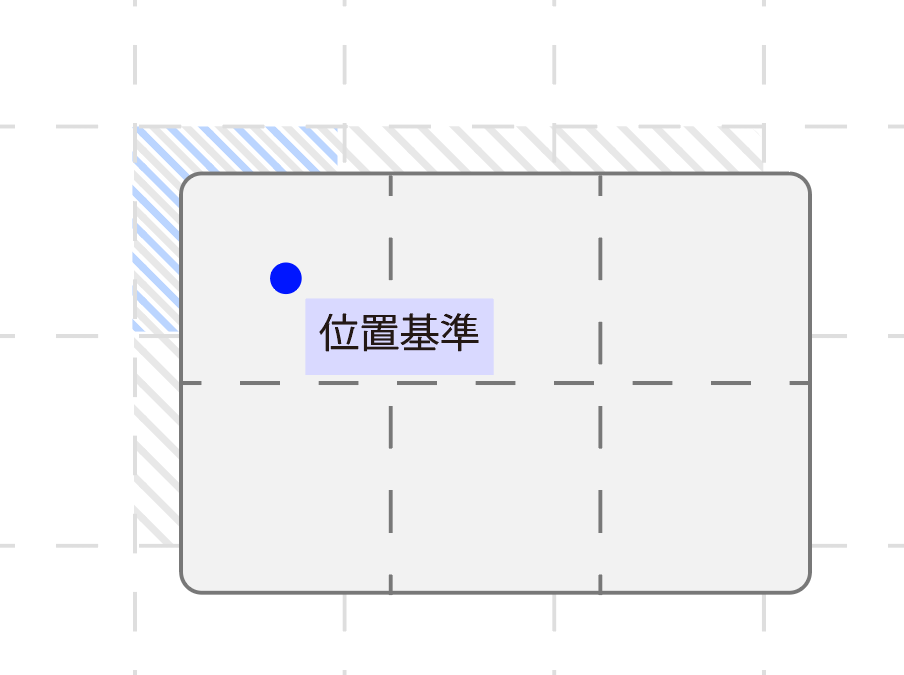
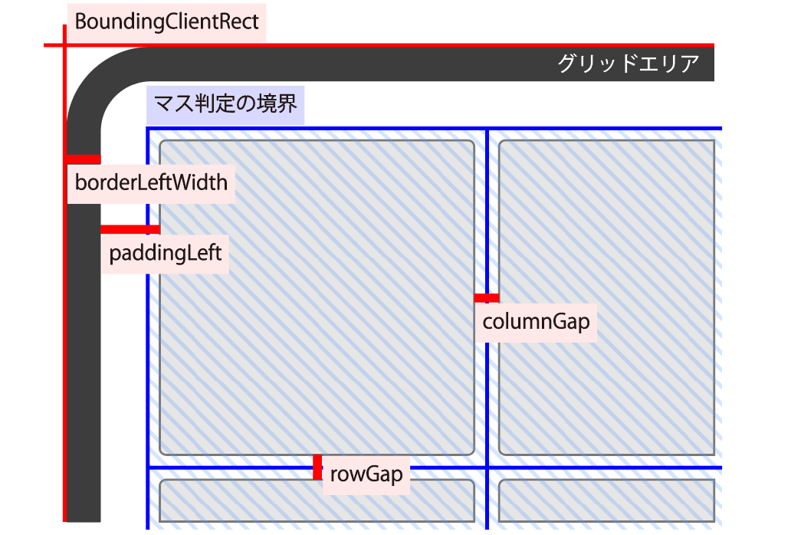

# Interactable Grid Layout Editor

##### インタラクタブルグリッドレイアウトエディタ

既存の有名なグリッドレイアウトエディタがflexboxを使っているものばかりだったので、gridを使ったエディタを作りたくなった。

flexboxよりも余白を自由に作れるのが利点。

---
## 大事な点

- ドラッグ＆ドロップで操作すること（イベント制御）
- 狙ったところに配置できること（座標制御）

## 必須項目

- ドラッグ可能な要素を用意
- 各エリア（グリッド、ゴミ箱、パレット）を用意
- ドラッグイベント実装
  - イベントリスナ系、座標計算、
    要素の移動/コピー/削除

---

## ドラッグ可能な要素を用意

#### CSSのカスタムプロパティを用いる

**--width, --height**

- grid外での要素サイズ計算用
  ```css
  width: calc( var(--width) * 3em );
  ```
- js上でgrid内のcolumn/row設定用
  ```js
  const width = parseInt(getComputedStyle(widget).getPropertyValue('--width'));
  widget.style.gridColumnEnd = startPos + width;
  ``` 

---
## グリッドエリアを用意

**--rows, --columns**
前述と同様、cssとjsで共通的に利用

```css
#grid {
    display: grid;
    box-sizing: border-box;

    grid-template-rows: repeat( var(--rows), 3em );
    grid-template-columns: repeat( var(--columns), 3em );
}
```
```js
const gridRows = parseInt(getComputedStyle(grid).getPropertyValue('--rows'));
```

---

#### ゴミ箱エリア
専用エリアか、或いは「グリッドの外すべてゴミ箱」とするのもアリ
html、css上で特に設定するものはない。

#### パレットエリア
テンプレートを置いておくため
必要なければパス

テンプレートを置く場合は、ドラッグ＆ドロップによって移動/削除されないようにする必要がある

---

## ドラッグイベントを実装

#### イベントリスナ系の設定

全`.widget`要素に**draggable=true**と'**dragstart**'イベントリスナを設定
＞ ドラッグ中変数、要素とカーソルの相対位置記録

`#grid`要素に'**dragover**'と'**drop**'イベントリスナを設定
＞'**dragover**'にはカーソル&グリッド座標の計算・更新を
　'**drop**'には要素の配置を実装

＊dragover中に配置プレビュー表示を実装するのもアリ

ゴミ箱にも'**dragover**'と'**drop**'イベントリスナを設定

---

#### 座標計算

- **gridは左上が原点（0, 0）**

- **グリッド位置基準を要素左上にする**
  - (正確には、ドラッグ開始時点の要素-カーソルの相対座標分のオフセットを入れたマウス座標)


- **gridのstyle：padding, border, gap等を考慮**


---

- **移動**
  ：グリッド内での位置調整
  座標style (`gridRowStart`, `gridRowEnd`...)を更新
- **コピー**
  ：テンプレートから持ってくる時
  `grabbed.cloneNode(true)`＋イベントリスナ設定＋
    座標style設定＋`grid.appendChild(cloned)`
- **削除**
  ：ゴミ箱エリアでドロップした時
  `grabbed.remove()`

---

おわり